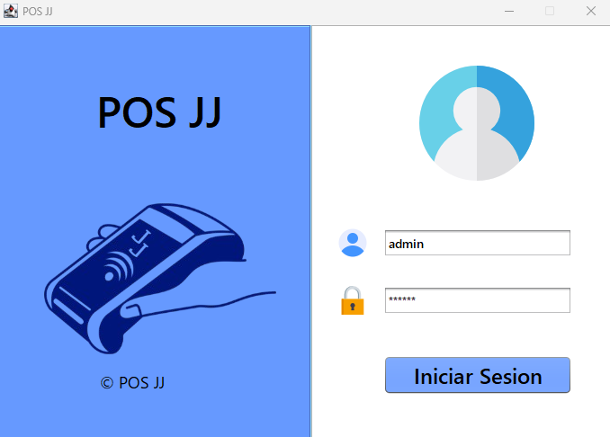
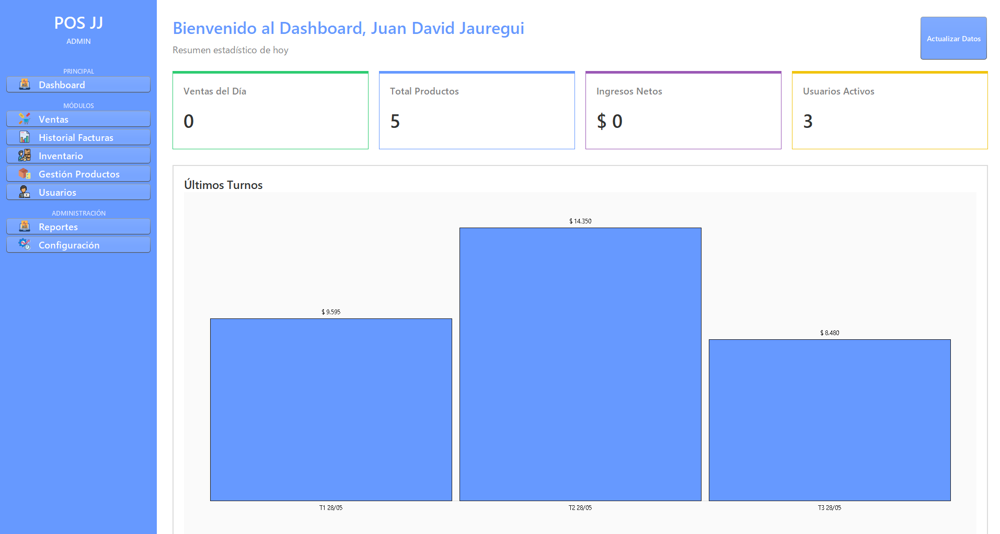
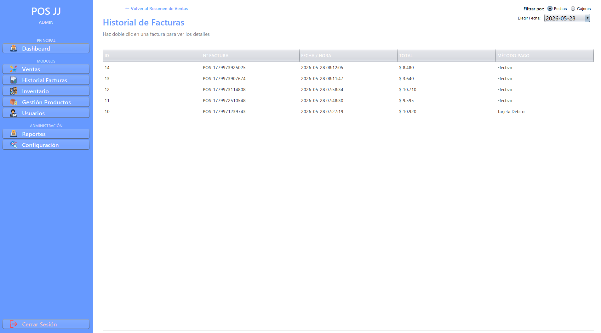
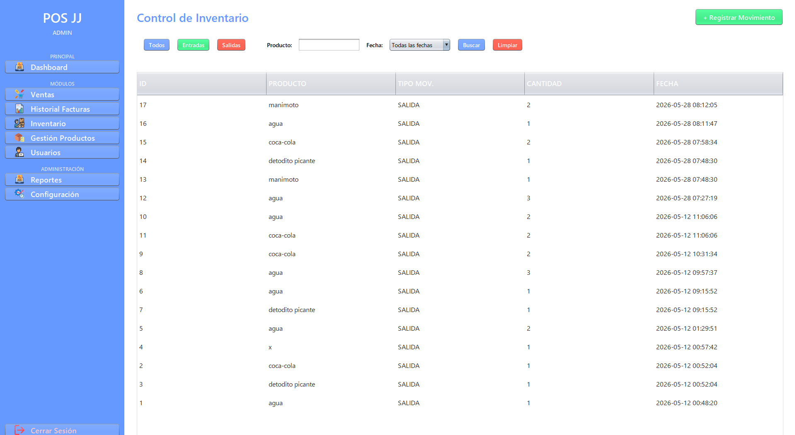
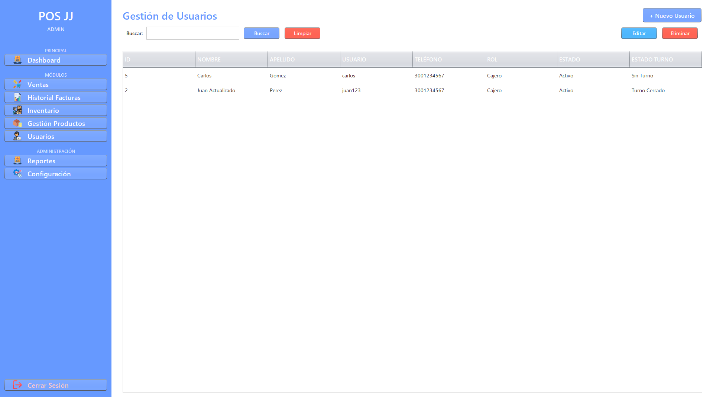
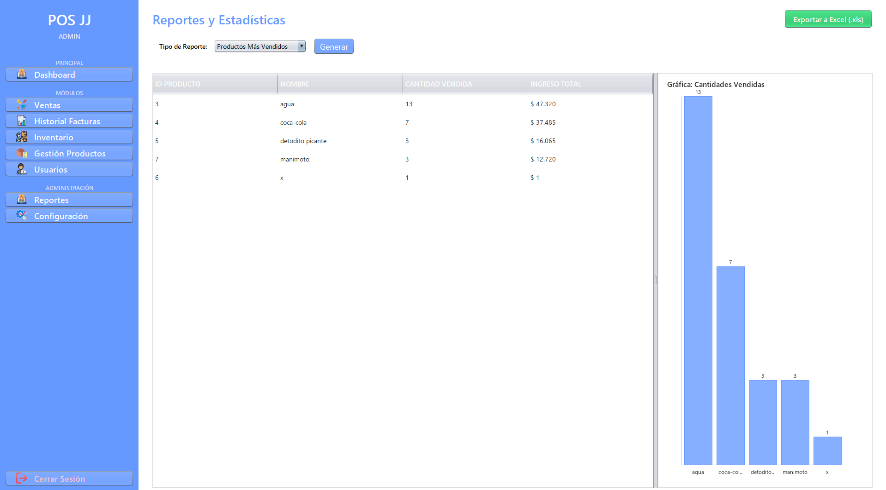
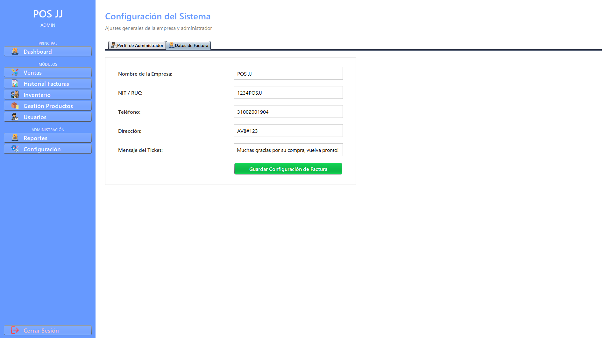
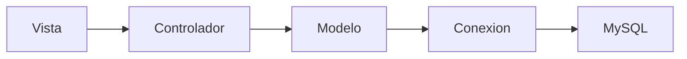

<div align="center">

# 🛒 POS JJ


### Sistema de Punto de Venta desarrollado en Java

Sistema POS diseñado para optimizar la administración de negocios mediante la gestión de ventas, inventario, productos, usuarios, clientes, turnos y reportes, ofreciendo una interfaz moderna, intuitiva y de fácil uso.


</div>

---

# 📑 Tabla de Contenido

- [Descripción](#-descripción)
- [Características](#-características)
- [Capturas del Sistema](#-capturas-del-sistema)
- [Arquitectura](#-arquitectura-del-proyecto)
- [Tecnologías](#-tecnologías-utilizadas)
- [Estructura del Proyecto](#-estructura-del-proyecto)
- [Base de Datos](#-base-de-datos)
- [Instalación](#-instalación)
- [Configuración](#-configuración)
- [Ejecución](#-ejecución-del-proyecto)
- [Autores](#-autores)
- [Mejoras Futuras](#-mejoras-futuras)

---

# 📖 Descripción

**POS JJ** es un sistema de Punto de Venta (POS) desarrollado en **Java** bajo el patrón de arquitectura **Modelo - Vista - Controlador (MVC)**.

El sistema fue diseñado para facilitar la administración de pequeños y medianos negocios, permitiendo controlar las operaciones comerciales desde una única aplicación de escritorio.

Entre sus principales funciones se encuentran la gestión de inventario, ventas, productos, usuarios, clientes, turnos, reportes y facturación.

Su objetivo es brindar una solución rápida, organizada y eficiente para la administración diaria de un establecimiento comercial.

---

# ✨ Características

## 🔐 Seguridad

- Inicio de sesión.
- Autenticación de usuarios.
- Roles de Administrador.
- Roles de Cajero.

## 🛍 Ventas

- Registro de ventas.
- Apertura de turno.
- Cierre de turno.
- Historial de facturas.
- Cálculo automático de IVA.
- Cálculo de subtotal.
- Cálculo del total de compra.

## 📦 Inventario

- Gestión de inventario.
- Registro de movimientos.
- Actualización automática del stock.
- Control de existencias.

## 📦 Productos

- Registrar productos.
- Editar productos.
- Eliminar productos.
- Buscar productos.
- Gestión de categorías.

## 👥 Usuarios

- Crear usuarios.
- Editar usuarios.
- Eliminar usuarios.
- Administración de permisos.

## 👤 Clientes

- Registro de clientes.
- Consulta de clientes.

## 📊 Reportes

- Reportes administrativos.
- Historial de ventas.
- Reportes del sistema.

## ⚙ Configuración

- Configuración general.
- Parámetros del sistema.

---

# 📸 Capturas del Sistema

## 🔐 Inicio de Sesión



---

## 📊 Dashboard



---

## 💰 Punto de Venta



---

## 🛒 Punto de Venta (Vista Cajero)


---

## 📦 Gestión de Productos


---

## 📦 Inventario



---

## 👥 Gestión de Usuarios



---

## 📈 Reportes



---

## ⚙️ Configuración



---

## 📊 Reporte de Ventas por Barras


# 🏛 Arquitectura del Proyecto

El proyecto sigue el patrón de arquitectura **MVC (Model - View - Controller)**.



## 📂 Organización

```
src
│
├── conexion
│     └── conexion.java
│
├── controlador
│     ├── Ctrl_Categoria.java
│     ├── Ctrl_Dashboard.java
│     ├── Ctrl_Factura.java
│     ├── Ctrl_Impresora.java
│     ├── Ctrl_Producto.java
│     ├── Ctrl_Turno.java
│     └── UsuarioDAO.java
│
├── modelo
│     ├── Categoria.java
│     ├── Cliente.java
│     ├── Producto.java
│     ├── Usuario.java
│     ├── Factura.java
│     ├── DetalleFactura.java
│     └── Turno.java
│
├── servidor
│     ├── Cliente.java
│     ├── RegistryServer.java
│     └── Servidor.java
│
├── vista
│
└── img
```

---

# 🛠 Tecnologías Utilizadas

| Tecnología | Descripción |
|------------|-------------|
| Java JDK 24 | Lenguaje principal |
| Java Swing | Interfaces gráficas |
| JDBC | Comunicación con MySQL |
| MySQL | Base de datos |
| MySQL Workbench | Administración de la BD |
| Apache Ant | Compilación del proyecto |
| iTextPDF | Generación de documentos PDF |
| JCalendar | Selección de fechas |
| Git | Control de versiones |
| GitHub | Hospedaje del proyecto |

---

# 🗄 Base de Datos

El sistema utiliza **MySQL** como motor de base de datos.

## Tablas principales

```
tb_usuario
tb_categoria
tb_producto
tb_cliente
tb_factura
tb_detalle_factura
tb_turno
tb_pago
tb_gr_pago
tb_movimiento_inventario
```

---

# ⚙ Instalación

## 1. Clonar el repositorio

```bash
git clone https://github.com/JuanPyStar/POS-JJ.git
```

---

## 2. Abrir el proyecto

Abrir el proyecto desde NetBeans.

---

## 3. Importar la base de datos

Crear una base de datos en MySQL e importar el archivo SQL correspondiente.

---

## 4. Configurar la conexión

Editar el archivo de conexión indicando:

- Host
- Puerto
- Usuario
- Contraseña
- Base de datos

---

## 5. Ejecutar

Compilar el proyecto utilizando Apache Ant o desde NetBeans.

---

# 💻 Requisitos

- Java JDK 24
- Apache NetBeans
- MySQL
- MySQL Workbench
- Apache Ant

---

# 📈 Flujo General del Sistema

```text
Inicio de Sesión
        │
        ▼
 Dashboard
        │
        ├───────────────┐
        │               │
        ▼               ▼
 Gestión Productos   Inventario
        │               │
        └──────┬────────┘
               ▼
          Punto de Venta
               │
               ▼
        Generación Factura
               │
               ▼
      Historial de Ventas
```

---

# 🚀 Futuras Mejoras

- Dashboard con estadísticas gráficas.
- Exportación de reportes a Excel.
- Integración con lectores de código de barras.
- Implementación de API REST.
- Sistema de notificaciones.
- Modo oscuro.
- Soporte para múltiples sucursales.
- Copias de seguridad automáticas.
- Aplicación móvil para consulta de inventario.

---

# 👨‍💻 Autores

### Juan David Jáuregui Zárate

GitHub:
https://github.com/JuanPyStar

---

### Juan Esteban Mantilla

Desarrollador del proyecto.

---

# ⭐ Si este proyecto te resultó útil

Puedes darle una ⭐ al repositorio para apoyar el proyecto.

---

<div align="center">

## POS JJ

**Sistema de Punto de Venta desarrollado en Java + MySQL**

© 2026 - Juan David Jáuregui Zárate & Juan Esteban Mantilla

</div>
